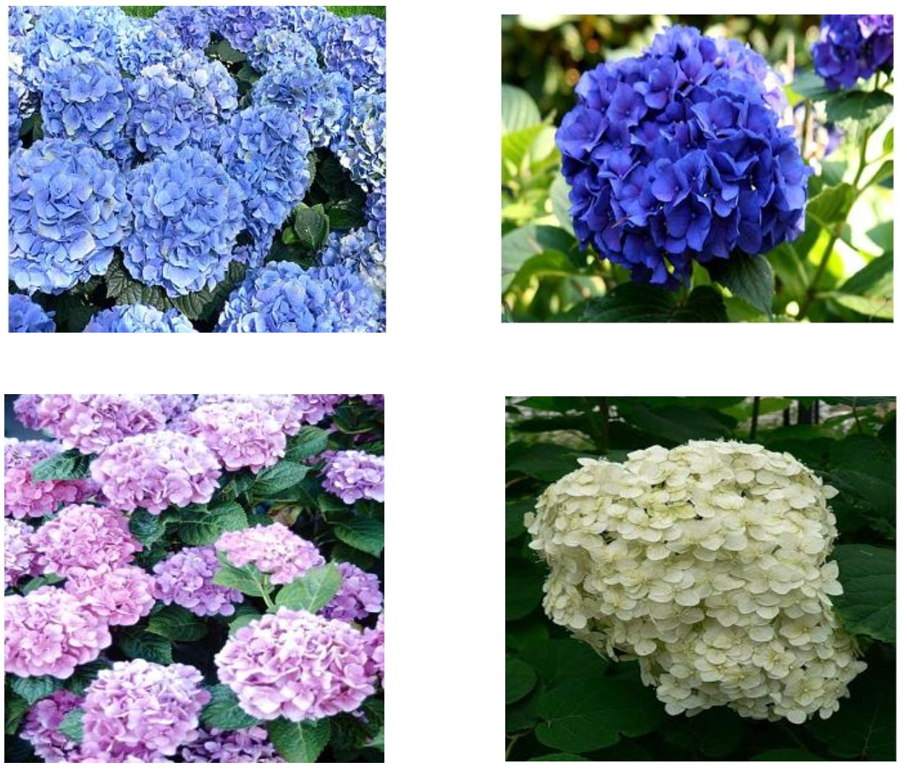
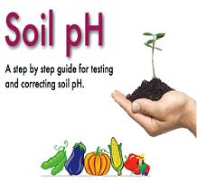

## Theory

<h2>Introduction:</h2>

A soil analysis is a process by which elements such as P, K, Ca, Mg, Na, S, Mn, Cu and Zn are chemically extracted from the soil and measured for their “plant available” content within the soil sample.

  

<h2>Significance of Soil Analysis:</h2>
<ul>
  <li>It increases the knowledge of what nutrients are especially available in our soil.</li>
  <li>It reduces the environmental impacts due to soil amendments.</li>
  <li>It increases the efficiency of resource inputs such as fertilisers and water.</li>
  <li>It helps to predict the nutritional values needed for crop production.</li>
  <li>It helps to evaluate the fertility status of soils of a country or a state or a district.</li>
</ul>

<h2>Procedure for Taking Good Soil Samples:</h2>
<ul>
  <li>Determine the soil unit (or plot).</li>
  <li>Make a traverse over the soil unit (or plot).</li>
  <li>Clean the site (with spade) from where soil sample is to be collected.</li>
  <li>Insert the spade into soil.</li>
  <li>Standing on the opposite side, again insert the spade into soil.</li>
  <li>A lump of soil is removed.</li>
  <li>A pit of ‘V’ shape is formed. Its depth should be 0-6" or 0-9" or 0-12" (i.e., Depth of tillage).</li>
  <li>Take out the soil-slice (like a bread slice) of ½ inch thick from both the exposed surfaces of the pit from top to bottom. This slice is also termed furrow-slice. To collect the soil-slice, spade may be used. Collect the soil samples in a polyethylene bucket.</li>
  <li>Collect furrow-slices from 8-10 or sometimes 20-30 sites. Select the sites at random in a zigzag (or criss-cross) manner. Distribute the sites throughout the entire soil unit (plot). In lieu of spade, auger may be used. Do not take the prohibited samples and local problem soils.</li>
  <li>Furnish the following information in two sheets of thick paper with the sample. One sheet is folded and kept inside the bag. Another sheet is folded and attached to the bag.</li>
</ul>

<h2>Hydrangeas... Blue or Pink?</h2>

Hydrangeas respond to the soil pH where they are planted.
They produce <strong>blue flowers</strong> in acid soil (pH 5.5 & below); if the soil is highly acidic, the color becomes the <em>bluest of blue</em>.
<strong>Pink flowers</strong> are produced in alkaline soil (pH 7 & above); if the soil is highly alkaline, the flower color can turn white, such as in the variety <em>‘Lanarth White’</em>.

 

<h2>Soil pH:</h2>

  

The soil pH reflects whether a soil is acidic, neutral, basic, or alkaline. The acidity, neutrality, or alkalinity of a soil is measured in terms of hydrogen ion activity of the soil water system.
The negative logarithm of the H+ ion activity is called pH. Thus, the pH of a soil is a measure of only the intensity of acidity and not the amount of acid present.
The pH range normally found in soils varies from 3 to 9.

<strong>Mathematically,</strong> pH is represented as: 
<code>log 1/H+ = -log H+</code>

<h3>Apparatus:</h3>

pH Meter, Physical Balance, Beaker, Glass Rod, etc.

<h3>Principle of Potentiometric Method:</h3>

This method is essentially based on the measurement of potential, developed across an indicator or the glass electrode due to the difference in activity of H+ ions inside and outside the electrode (i.e., in the bathing solution).
The potential difference between the glass electrode and the calomel electrode is expressed in pH units.

### Soil pH and Interpretation:

<table>
  <tr>
    <td>&lt;5.0</td>
    <td>Strongly Acid</td>
  </tr>
  <tr>
    <td>5.5</td>
    <td>Moderately Acid</td>
  </tr>
  <tr>
    <td>6.0</td>
    <td>Slightly Acid</td>
  </tr>
  <tr>
    <td>6.5–7.5</td>
    <td>Neutral <em>Best range for Most Crops</em></td>
  </tr>
  <tr>
    <td>7.5–8.5</td>
    <td>Moderately Alkaline</td>
  </tr>
  <tr>
    <td>&gt;8.5</td>
    <td>Strongly Alkaline</td>
  </tr>
 
</table>

### pH Requirements of Some of the Commonly Grown Vegetables:

<table>
  <tr>
    <th>Image</th>
    <th>Vegetable</th>
    <th>Soil pH Range</th>
  </tr>
  <tr>
    <td> </td>
    <td>Potato</td>
    <td>4.5 – 6.0</td>
  </tr>
  <tr>
    <td></td>
    <td>Pumpkin</td>
    <td>5.5 – 7.5</td>
  </tr>
  <tr>
    <td></td>
    <td>Cucumber</td>
    <td>6.0 – 7.0</td>
  </tr>
  <tr>
    <td></td>
    <td>Cauliflower</td>
    <td>6.0 – 7.5</td>
  </tr>
  <tr>
    <td></td>
    <td>Tomato</td>
    <td>6.0 – 7.5</td>
  </tr>
  <tr>
    <td></td>
    <td>Onion</td>
    <td>6.0 – 7.5</td>
  </tr>
  <tr>
    <td></td>
    <td>Lettuce</td>
    <td>6.0 – 7.5</td>
  </tr>
  <tr>
    <td></td>    
    <td>Cabbage</td>
    <td>6.0 – 7.5</td>
  </tr>
  <tr>
    <td></td>
    <td>Spinach</td>
    <td>6.0 – 7.5</td>
  </tr>
  <tr>
    <td></td>
    <td>Beans</td>
    <td>6.0 – 7.5</td>
  </tr>
</table>

<h2>Importance of pH:</h2>

<ul>
  <li>pH determination is an indispensable means for characterizing soil from the standpoint of nutrient availability, physical condition, structure, and permeability.</li>
  <li>It provides information on the potency of toxic substances present in the soil.</li>
  <li>It indicates the status of microbial communities and their effects on the neutralization of organic residue and nutrient availability.</li>
  <li>Determining soil pH offers a rational basis for managing soil for specific agricultural crops.</li>
  <li>The pH of soil in water and KCl systems reveals the nature of charge discharge on soil colloids, which impacts nutrient behavior and reactions.</li>
</ul>

<h2>How to Reduce the Alkalinity of Soil?</h2>

Yards with high alkaline soil (pH 8 and above) may be difficult for cultivation. Alkalinity can be reduced by applying <strong>Ammonium Sulphate</strong> and organic materials, which help lower soil pH.

Likewise, soil acidity can be reduced by adding <strong>lime</strong> to highly acidic soils, which raises the pH level.

